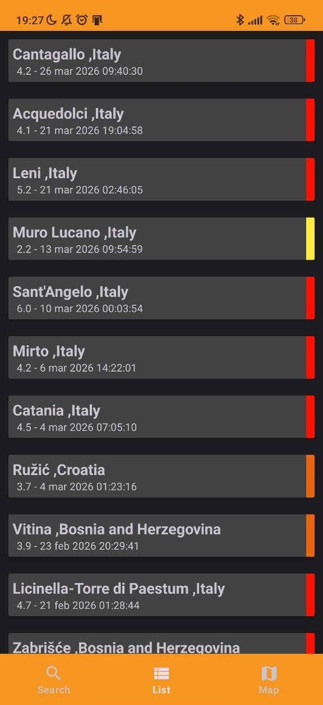
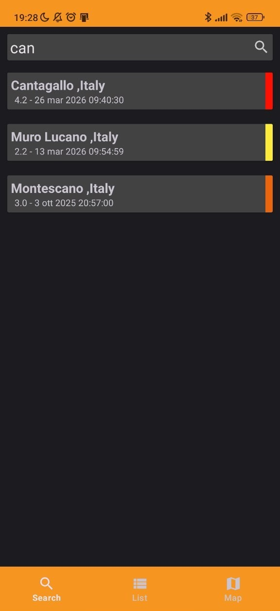
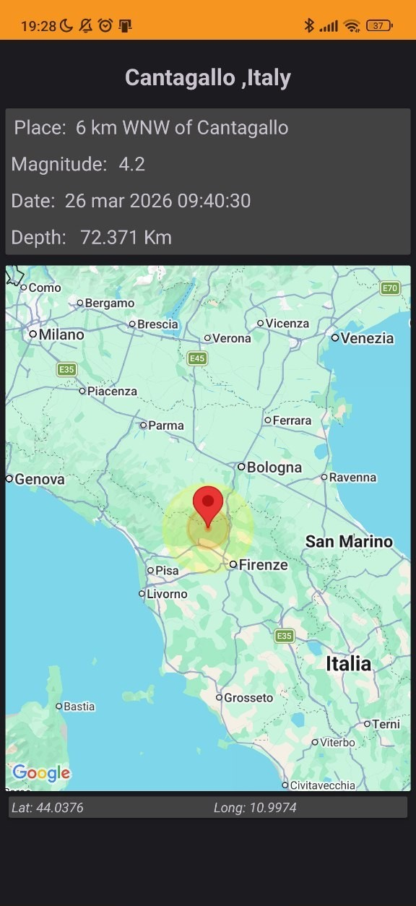
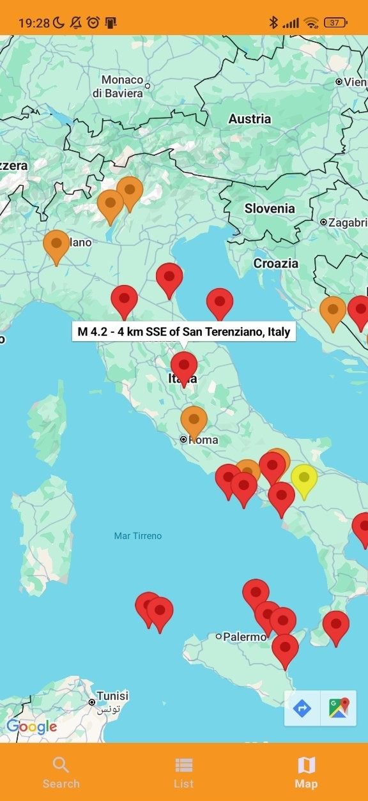
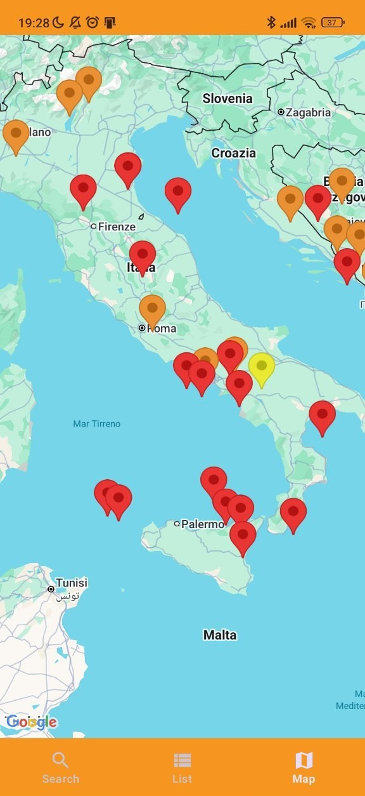

# Earthquake Mobile

<p align="center">
  
</p>

<p align="center">
  
  
  
  
  
  
  
  
  
</p>

<p align="center">
  Native Android application for monitoring and exploring earthquakes in Italy through list browsing, live search, map visualization, and local persistence.
</p>

---

## Overview

**Earthquake Mobile** is a native Android application designed to help users explore earthquake activity in Italy through a clean and practical mobile interface.

The application combines:
- remote earthquake retrieval
- local persistence with Room
- live search by location
- map-based visualization with Google Maps
- a dedicated detail screen for focused event inspection

This project is a compact but complete example of a real Android application, bringing together networking, persistence, navigation, and UI interaction in a single product.

---

## Main Features

### Earthquake list browsing
The app provides a list-based view of the downloaded earthquake dataset.

This allows users to:
- scan recent events quickly
- compare multiple earthquakes at a glance
- open a specific earthquake for detailed inspection

### Swipe-to-refresh
The main list supports manual refresh through a swipe-down gesture.

This gives the user direct control over updating the data and makes the application feel more dynamic.

### Live search by location
The search feature filters earthquakes in real time while the user types.

The filtering logic is based on textual location-related fields such as:
- place
- country
- state

This makes the dataset much easier to explore when many events are available.

### Interactive map visualization
The map screen displays earthquake positions through Google Maps.

This helps users:
- understand where events occurred
- visually compare geographic distribution
- move from a map marker to the earthquake detail view

### Dedicated detail screen
Each earthquake can be opened in a dedicated detail page.

This screen is useful for focusing on a single event and understanding it more clearly through:
- event metadata
- map-based context
- visual impact representation

### Local persistence
Earthquake data is cached locally with Room.

This means the app can reuse stored data and follow a more realistic mobile architecture instead of relying only on fresh requests.

---

## UI Walkthrough

<table>
  <tr>
    <td width="260" align="center" valign="top">
      
    </td>
    <td valign="top">
      <h3>Homepage</h3>
      <p>
        The <b>Homepage</b> is the main entry point of the application and provides an overview of the available earthquake data.
      </p>
      <p>
        From this screen, users can browse the list of recorded earthquakes, get a quick overview of recent events,
        access the main navigation flow of the application, and refresh the dataset manually.
      </p>
      <p>
        This screen acts as the central hub of the app and makes the earthquake dataset immediately accessible.
      </p>
    </td>
  </tr>

  <tr>
    <td width="260" align="center" valign="top">
      
    </td>
    <td valign="top">
      <h3>Search</h3>
      <p>
        The <b>Search</b> screen allows users to filter earthquakes in real time by typing a location-related keyword.
      </p>
      <p>
        This feature is useful for narrowing the dataset quickly, finding earthquakes related to a specific place,
        and improving usability when many events are available.
      </p>
      <p>
        The live filtering behavior makes earthquake exploration faster and more interactive than a static list.
      </p>
    </td>
  </tr>

  <tr>
    <td width="260" align="center" valign="top">
      
    </td>
    <td valign="top">
      <h3>Details</h3>
      <p>
        The <b>Details</b> screen is dedicated to a single earthquake event.
      </p>
      <p>
        Here the user can inspect the main information in a clearer and more focused way, such as title and place,
        magnitude, depth, coordinates, and other event-specific information.
      </p>
      <p>
        This screen shifts the experience from general exploration to focused event analysis.
      </p>
    </td>
  </tr>

  <tr>
    <td width="260" align="center" valign="top">
      
    </td>
    <td valign="top">
      <h3>Map Detail</h3>
      <p>
        The <b>Map Detail</b> screen provides a geographic view centered on a selected earthquake.
      </p>
      <p>
        Its purpose is to give more spatial context to the event and improve interpretation through location-based visualization.
      </p>
      <p>
        This makes the selected earthquake easier to understand not only as raw data, but also as a real geographic occurrence.
      </p>
    </td>
  </tr>

  <tr>
    <td width="260" align="center" valign="top">
      
    </td>
    <td valign="top">
      <h3>Map</h3>
      <p>
        The <b>Map</b> screen displays earthquake positions on Google Maps, giving the user a broader spatial overview of the dataset.
      </p>
      <p>
        This screen is useful for understanding where earthquakes are distributed, visually comparing multiple events,
        exploring the data geographically, and opening a more focused view for a selected event.
      </p>
      <p>
        It is one of the most visually powerful parts of the application and adds strong value to the overall experience.
      </p>
    </td>
  </tr>
</table>

---

## Tech Stack

- **Language:** Java
- **Platform:** Android
- **Build System:** Gradle Kotlin DSL
- **Persistence:** Room
- **Navigation:** Android Navigation Component
- **Networking:** Cronet
- **Maps:** Google Maps SDK
- **UI Binding:** ViewBinding + DataBinding

---

## Architecture

The project is organized as a native Android application with a clear separation between screens, state handling, networking, and persistence.

### UI Layer
The UI layer includes the main screens and user-facing components:

- `MainActivity`
- `ListFragment`
- `SearchFragment`
- `MapFragment`
- `DetailActivity`
- `EarthquakeAdapter`

### Presentation Layer
The application state is coordinated through:

- `MainViewModel`

The ViewModel is responsible for exposing earthquake data to the UI, refreshing data, and filtering the dataset by location.

### Data Layer
The data flow is handled through:

- `Repository`
- `Request`

This is where remote data retrieval is performed and prepared for the rest of the app.

### Persistence Layer
Local data is cached through Room components:

- `DB`
- `EarthquakeDAO`
- `DateConverter`

### Model Layer
The core domain entity is:

- `Earthquake`

---

## How the App Works

A simplified version of the application flow is the following:

1. The app starts and loads the main interface
2. Cached earthquakes are checked locally
3. If needed, remote earthquake data is downloaded
4. The response is parsed into earthquake objects
5. The local database is updated
6. The UI observes the dataset and renders it
7. The user can browse, search, visualize, and inspect earthquakes

This makes the project more than a simple UI prototype: it behaves like a real mobile application with a complete data lifecycle.

---

## Project Structure

```text
app/
└── src/main/
    ├── java/com/example/earthquakemobile/
    │   ├── database/
    │   │   ├── DB.java
    │   │   ├── DateConverter.java
    │   │   └── EarthquakeDAO.java
    │   ├── model/
    │   │   └── Earthquake.java
    │   ├── service/
    │   │   ├── LocationHelper.java
    │   │   ├── MainViewModel.java
    │   │   ├── Repository.java
    │   │   └── Request.java
    │   ├── DetailActivity.java
    │   ├── EarthquakeAdapter.java
    │   ├── EarthquakeMobile.java
    │   ├── ListFragment.java
    │   ├── MainActivity.java
    │   ├── MapFragment.java
    │   └── SearchFragment.java
    ├── res/
    └── AndroidManifest.xml
